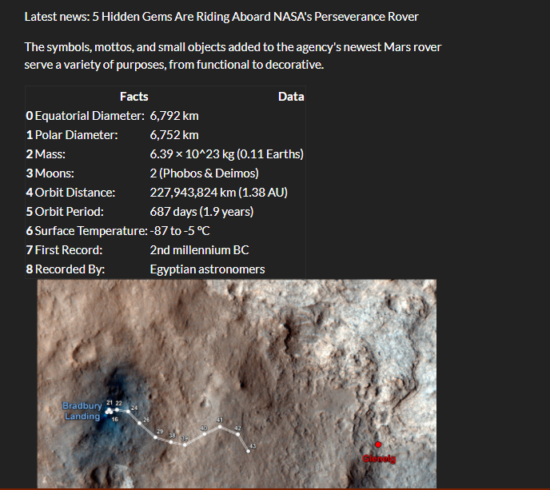

# Web Scraping Project - Mars information

## By Erick Hernandez

For this project I had to develop a Python code that could scrape from different sources, store the information into Mongo DB and rendering with Flask and HTML.

The project follows the next structure:

-> Site inspection
-> Identification of required information and extraction
-> Storing into MongoDB
-> Rendering of HTML templates with Pymongo and Flask modules

The initial analysis was carried out with Jupyter notebooks. After proving its feasibility, the script was imported to a single python script file and defined a new function that would gather the whole process into one variable.
The information would be stored with MongoDB using pymongo module. With this information available, a Flask app was designed so the local host would render a HTML site, showing the aforementioned data.

As per the functionality of the site, a link to a /scrape site is included, that would trigger an updated scraping query.

